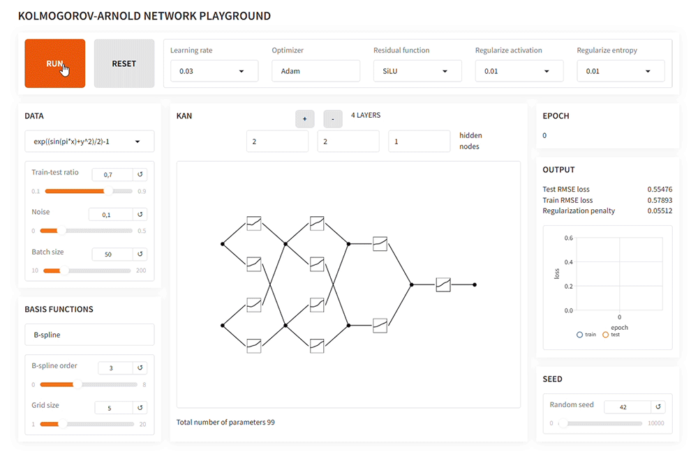

# Kolmogorov-Arnold Network playground

**KAN playground** is an interactive tool for exploring Kolmogorov-Arnold Networks, based on the paper ["KAN: Kolmogorov-Arnold Networks"](https://arxiv.org/abs/2404.19756). It features a **PyTorch** implementation of the model and an interface built with **Gradio**.  In the playground you can modify network parameters, train on toy datasets, and visualize the training process in real-time. Available on [Hugging Face Spaces](https://huggingface.co/spaces/qksolov/kan-playground).

## Demo

## Planned Features
- Adding different types of basis functions for parameterizing single-variable functions.
- Adding an option for training with dynamic grid adjustments.